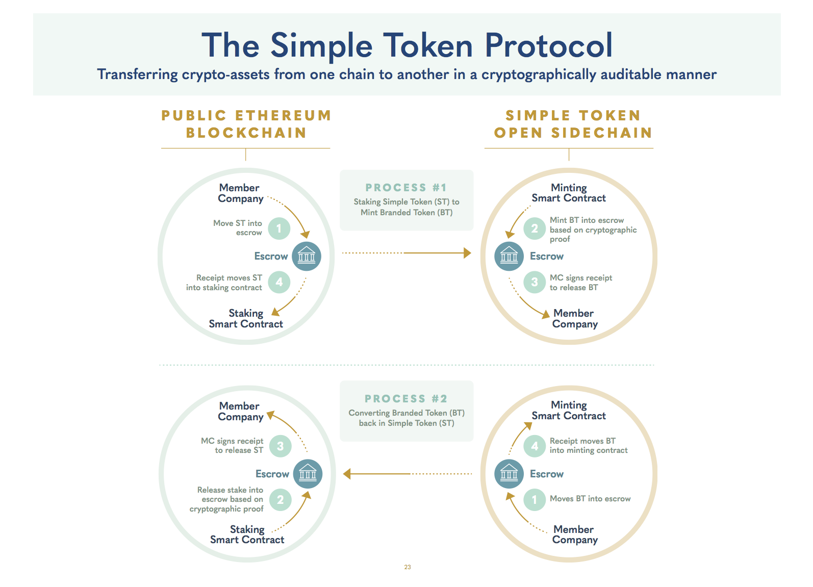

# [OpenST protocol](https://simpletoken.org) - staking value for utility

[](https://gitter.im/OpenSTFoundation/SimpleToken)

While OpenST 0.9 is available as-is for anyone to use, we caution that this is early stage software and under heavy ongoing development and improvement. Please report bugs and suggested improvements.

OpenST v0.9.1 is the first release deployed on Ethereum mainnet combined with the
activation of Simple Token to power the OpenST platform.  The OpenST platform
allows Ethereum smart contracts to runs faster and cheaper while leveraging
the security properties of Ethereum's Proof-of-Work.  In this release we implement
the first corner stone of the protocol: the ability to stake value on Ethereum
mainnet and mint a new representation of that value on a utility chain,
effectively increasing the computational throughput of Ethereum smart contracts
by allowing parallel execution across chains.

OpenST smart contracts have been restructured to store value separately from
the logic that implements the protocol.  v0.9.1 is not yet protocol complete
as the validators are whitelisted and not yet open with stake put forward on
Ethereum mainnet.  However, by splitting the protocol implementation into
these two logically separate problems, we can already start working with
member companies and developers to fine-tune the APIs and the developer
experience to build mainstream applications on Ethereum.

```
  Ethereum mainnet (value)   |  OpenST platform (utility)
  ---------------------------------------------------------------------
      Core - - - - - - - - - - - (Core)
      /                      |      \
     /                       |       \
  Registrar                  |  Registrar
    |                        |        |
  OpenSTValue                |  OpenSTUtility
    \_ SimpleStake           |    \_ UtilityTokenAbstract
                             |         \_ SimpleTokenPrime (base token)
                             |         \_ BrandedToken
```

Watch demo video of milestone 1 (v0.9.0 - will take you to [https://www.youtube.com/watch?v=-SxJ8c1Xh_A](https://www.youtube.com/watch?v=-SxJ8c1Xh_A))

[](https://www.youtube.com/watch?v=-SxJ8c1Xh_A)

## About Simple Token

Simple Token [“ST”] is an EIP20 token and OpenST is a protocol to support token economies in mainstream consumer applications. The business and technical challenge we set out to solve is to enable mainstream consumer applications to benefit from deploying their own branded crypto-backed token economies, in a scalable and cryptographically auditable manner, without needing to mint and maintain their own publicly-tradeable EIP20 tokens.

The OpenST protocol enables the creation of utility tokens on a utility blockchain while the value of those tokens is backed by staked crypto-assets on a value blockchain.

The OpenST Protocol establishes a bridge between two differently purposed blockchains.  A value blockchain, which is required in order to hold cryptographically secured valuable assets; and a utility blockchain, which has utility tokens in favor of which the assets are held on the value blockchain.

## OpenST Protocol

To mint utility tokens on a utility chain out of value staked on a value chain, or to redeem value on the value chain by redeeming ownership of utility tokens on the utility chain, the protocol needs to atomically act on two blockchains.  OpenST Protocol requires a two-phased commit for either action.

`openst-protocol` provides the smart contracts that implement the OpenST protocol which enables staking and redeeming utility tokens. For more details see the technical white paper on [simpletoken.org/documents](https://simpletoken.org/documents).



## Roadmap

Milestone 1 : OpenST Platform v0.9 (7 November 2017)

Milestone 2 : OpenST Platform v1.0 (Q1 2018)

Milestone 3 : Public Launch of Initial Member Companies (Q2 2018)

Milestone 4 : 10 Founding Member Companies (Q3-Q4 2018)

Milestone 5 : Consolidation of OpenST as open platform (2019)
